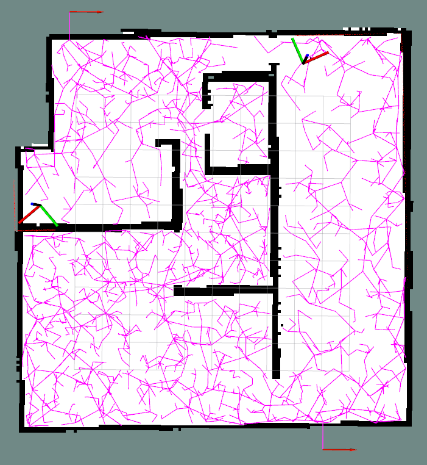
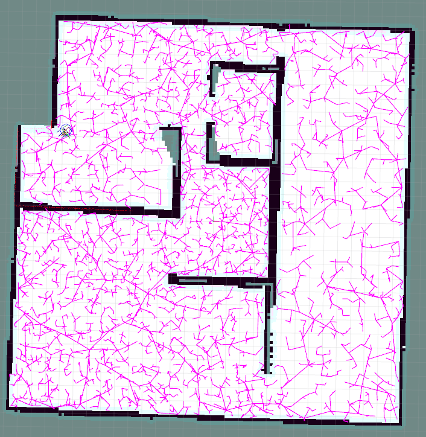
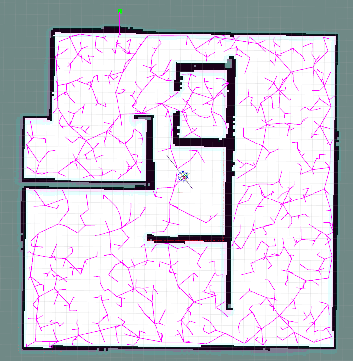
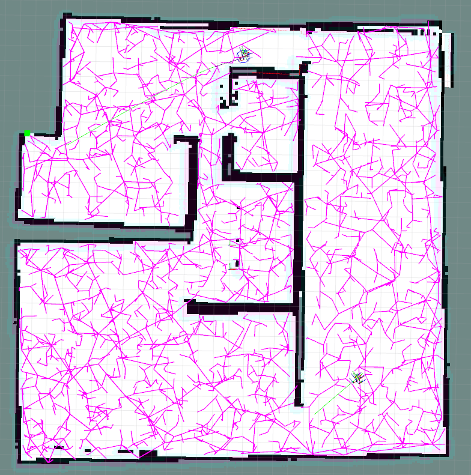

# Overview

This repo is the simulation version of RRT Exploration for single robot or multiple robots.


## Environment
PC: 
- ubuntu 18.04
- ROS melodic


## Dependency

### rosdep initialization nad update
```
rosdep init
rosdep update
```
If 'rosdep init' complains "ros init Website may be down.". Then run the following codes to manually add related initialization file in your ubuntu system.

One of the reason is the website "http://raw.githubusercontent.com" has been blocked so that your machine cannot get the ip address of it. And the corresponding solution is to search the real ip address of this website and put the real ip address into /etc/hosts (ubuntu 18.04) followint the below format.

```
sudo vi /etc/hosts
# put the next line into /etc/host
<real_ip_address>  raw.githubusercontent.com
```

One of the way to get the read ip address is searching on this website [https://www.ipaddress.com/](https://www.ipaddress.com/) 


Then rerun 
```
rosdep init
rosdep udpate
```

### kobuki related packages
kobuki related packages are not installed by default when installing the ros-melodic-desktop-full.
Two Packages need to be installed on your ubuntu system.

#### PLAN A
1. kobuki_desktop
```
mkdir ~/kobuki_desktop_ws && cd ~/kobuki_desktop_ws
mkdir src && cd src
git clone https://github.com/yujinrobot/kobuki_desktop
cd ../
rosdep install --from-paths src --ignore-src -r -y
```
2. kobuki_msgs
```
mkdir ~/kobuki_msgs_ws && cd ~/kobuki_msgs_ws
mkdir src && cd src
git clone https://github.com/yujinrobot/kobuki_msgs
cd ../
rosdep install --from-paths src --ignore-src -r -y
```
#### PLAN B
For simplification, we put all supporting files under the install_support_files directory of this repo. Follow README.md in that directory to install environment requirements.


### Map Merge
The relative poses and transformations are manually setup in the .launch file. 

Maps from all robots are merged together using the mapmerge_node in the mapmerge package. There is an alternative map merge package [multirobot_map_merge](https://github.com/hrnr/m-explore). However, this package uses OpenCV libraries to merge maps from all different robots. The origin of the odometry is the center of the input map, for which the location of origin will changes when receiving different maps. On the contrary, the origin of odometry of the real robot in the simulation environment or in the real world is fixed all the time. As a result, the merged map will be invalid in real robots' situation. This new map merge is modified from [mapmerge package](https://github.com/donghl17/RRT-Github-Test) to enhance the robustness: Maps from different robots are merged using ros-based message types and functions. 


## Ready to Run 
- Setup a catkin_workspace and put this repo under the src directory.
- Use catkin_make to build the package.
- Source the environment path.
- Run the following code in terminal.


## Overview
This repo implements the ros-based autonomous exploration function using Rapid Random Tree (RRT). In order for different users, I offer both cpp and python version. Follow the instructions below to checkout the two version.


## CPP Version RRT Exploration
The CPP Version surpass python version in time efficiency since CPP based nodes run nearly 10X faster than python based nodes with the same functions.

For two cars: Before runnning the two robots version. The ```#define SECOND_ROBOT``` (line 8) should be uncommented and using ```catkin_make``` to re-compile the whole package.

```
// Terminal 1
roslaunch rrt_exploration_tutorials multiple_simulated_house.launch

// Terminal 2
roslaunch rrt_exploration  two_sim_rrt_node.launch 

// click one points at any place in RVIZ to start the exploration.
```



For single car
```
// Terminal 1
roslaunch rrt_exploration_tutorials single_simulated_house.launch

// Terminal 2
roslaunch rrt_exploration  single_sim_rrt_node.launch 

// click one points at any place in RVIZ to start the exploration.
```


## python Version RRT Exploration
The python version is easy to debug since it will directly complain the kind of errors and warnings when programs die. Therefore, it's easy for beginner to understand what the exploration system has been doing.

### Single Robot Simulation in house
```
// Terminal 1
roslaunch rrt_exploration_tutorials single_simulated_house.launch

// Terminal 2
roslaunch rrt_exploration single_sim_python_multi_node.launch

// click one points at any place in RVIZ to start the exploration.
```



### Multiple Robots Simulation in house (two robot)
```
// Terminal 1
roslaunch rrt_exploration_tutorials multiple_simulated_house.launch

// Terminal 2
roslaunch rrt_exploration single_multi_python_multi_node.launch

// click one points at any place in RVIZ to start the exploration.
```



Have Fun :)
