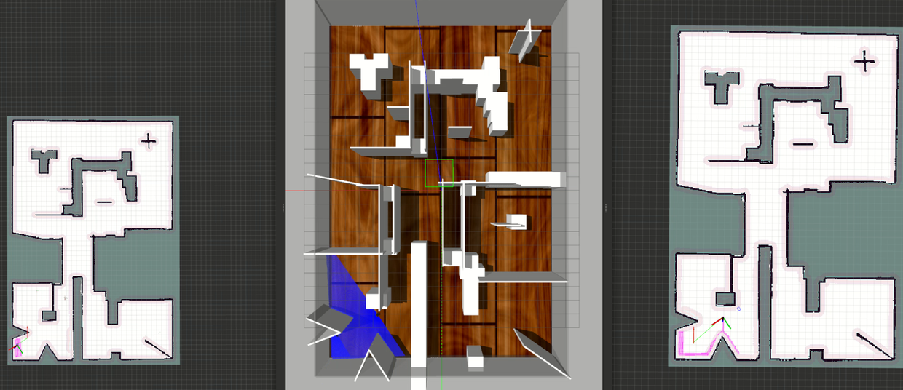

# Overview

This repo is simulation version of multiple real cars deployment.

Artificial Potential Field (APF) + cartographer + map merge without knowing the relative starting position of different robots + only sharing Occupancy Grid among robots. 

cartographer_operation directory contains nodes to merge cartographer submaps (either based on input rgb image from camera sensor or only submaps without using image), change the cartographer map into discrete value (-1: unknown, 0: free, 100: obstacle).

## Environment
PC: 
- ubuntu 18.04
- ROS melodic

## rosdep initialization nad update
```
rosdep init
rosdep update
```
If 'rosdep init' complains "ros init Website may be down.". Then run the following codes to manually add related initialization file in your ubuntu system.

One of the reason is the website "http://raw.githubusercontent.com" has been blocked so that your machine cannot get the ip address of it. And the corresponding solution is to search the real ip address of this website and put the real ip address into /etc/hosts (ubuntu 18.04) followint the below format.

```
sudo vi /etc/hosts
# put the next line into /etc/host
<real_ip_address>  raw.githubusercontent.com
```

One of the way to get the read ip address is searching on this website [https://www.ipaddress.com/](https://www.ipaddress.com/) 


Then rerun 
```
rosdep init
rosdep udpate
```

## Get the Neural Network Model
Please Contact me to get the trained NN model ```m-explore/map_merge/include/weights/gem.pth```
and ```real_cars_simulation/xtark_ros_wrapper/scripts/model_test.ckpt```

## Ready to Run 
- Setup a catkin_workspace and put this repo under the src directory.
- Use catkin_make to build the package.
- Source the environment path.
- Replace the ```/opt/ros/melodic/share/turtlebot3_description/urdf/turtlebot3_burger.gazebo.xacro``` with ```./urdf/turtlebot3_burger.gazebo.xacro```
- Run
```
// Terminal 1
roslaunch turtlebot3sim gazebohouse_robots_narrow.launch

// Terminal 2
roslaunch turtlebot3sim two_carto_robots_hardware_teb.launch

// Terminal 3
roslaunch apf multi_sim_apf_node.launch

// click one points at any place in RVIZ to start the exploration.
```



Have Fun :)
